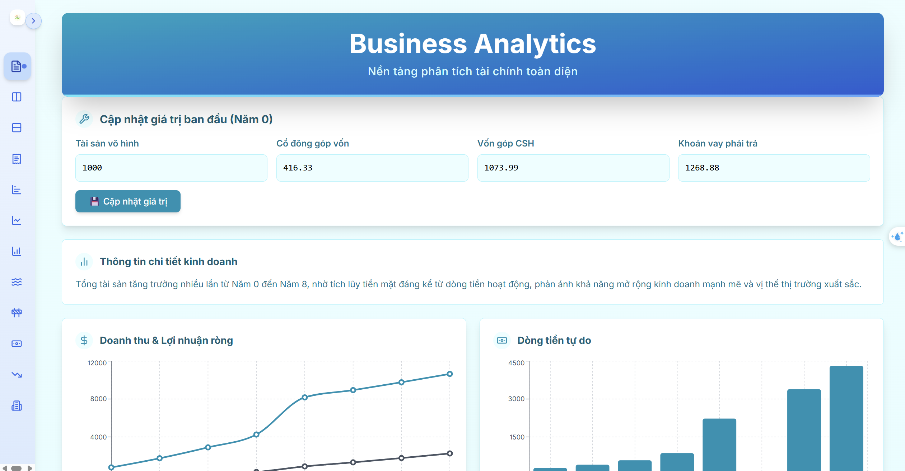
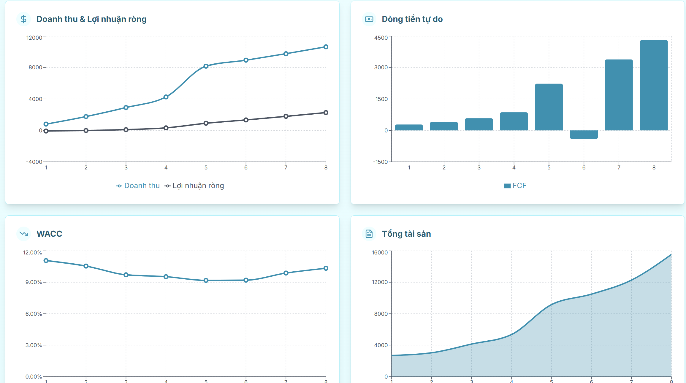
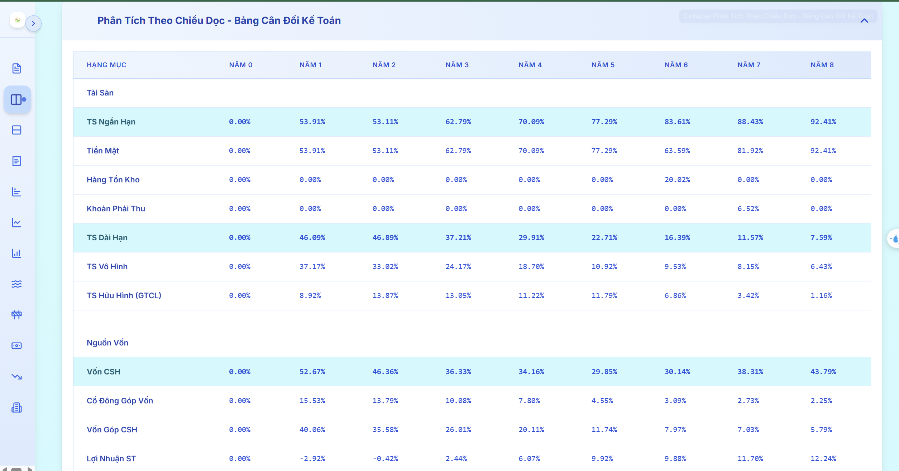
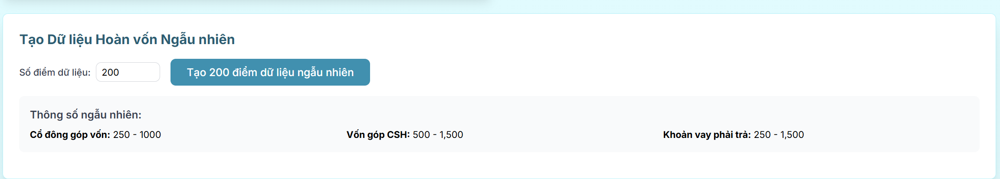
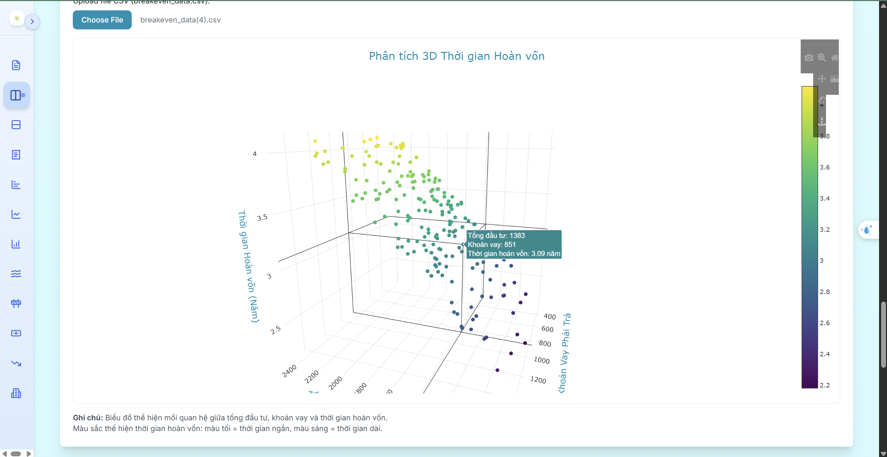

<div align="left" style="position: relative;">

<h1>FINANCIAL_DASHBOARD</h1>
<p align="left">
	<em><code>❯ Group1-QTDVDL</code></em>
</p>
<p align="left">
	
	
	
</p>
<p align="left"><!-- default option, no dependency badges. -->
</p>
<p align="left">
	<!-- default option, no dependency badges. -->
</p>
</div>
<br clear="right">

## 🔗 Table of Contents

1. [📍 Overview](#-overview)
2. [👾 Features](#-features)
3. [📁 Project Structure](#-project-structure)
  3.1. [📂 Project Index](#-project-index)
4. [🚀 Getting Started](#-getting-started)
  4.1. [☑️ Prerequisites](#-prerequisites)
  4.2. [⚙️ Installation](#-installation)
  4.3. [🤖 Usage](#🤖-usage)
5. [📌 Project Roadmap](#-project-roadmap)
6. [🔰 Contributing](#-contributing)
7. [🙌 Acknowledgments](#-acknowledgments)

---

## 📍 Overview
This repository contains a financial analysis and projection for a milk tea business startup in Cần Thơ, Vietnam. The project models a 5-year business plan, including revenue forecasts, cost estimates, profit calculations, and key financial metrics such as EPS and ROE. The analysis accounts for initial capital contributions, bank loans, fixed and variable costs, and an expansion strategy involving new store openings. The accompanying code and documentation provide a detailed breakdown of the financial model, visualized through charts and supported by strategic recommendations for optimizing profitability and growth.:


---

## 👾 Features

<p align="center">
  <br>
  <em>User Interface Overview</em>
</p>

<p align="center">
  <br>
  <em>Summary of Business Statistics</em>
</p>

<p align="center">
  <br>
  <em>Detailed Business Performance Table</em>
</p>

<p align="center">
  <br>
  <em>Random Data Generation Feature</em>
</p>

<p align="center">
  <br>
  <em>Data Visualization Charts</em>
</p>
---

## 📁 Project Structure

```sh
└── financial_dashboard/
    ├── README.md
    ├── SQL code
    ├── eslint.config.js
    ├── index.html
    ├── package-lock.json
    ├── package.json
    ├── postcss.config.js
    ├── public
    │   ├── logo.png
    │   └── vite.svg
    ├── src
    │   ├── App.css
    │   ├── assets
    │   ├── components
    │   ├── hooks
    │   ├── index.css
    │   ├── main.jsx
    │   ├── services
    │   ├── styles
    │   └── utils
    ├── tailwind.config.js
    └── vite.config.js
```


### 📂 Project Index
<details open>
	<summary><b><code>FINANCIAL_DASHBOARD/</code></b></summary>
	<details> <!-- __root__ Submodule -->
		<summary><b>__root__</b></summary>
		<blockquote>
			<table>
			<tr>
				<td><b><a href='https://github.com/ptmnhu/financial_dashboard/blob/master/postcss.config.js'>postcss.config.js</a></b></td>
				<td><code>❯ REPLACE-ME</code></td>
			</tr>
			<tr>
				<td><b><a href='https://github.com/ptmnhu/financial_dashboard/blob/master/package-lock.json'>package-lock.json</a></b></td>
				<td><code>❯ REPLACE-ME</code></td>
			</tr>
			<tr>
				<td><b><a href='https://github.com/ptmnhu/financial_dashboard/blob/master/tailwind.config.js'>tailwind.config.js</a></b></td>
				<td><code>❯ REPLACE-ME</code></td>
			</tr>
			<tr>
				<td><b><a href='https://github.com/ptmnhu/financial_dashboard/blob/master/vite.config.js'>vite.config.js</a></b></td>
				<td><code>❯ REPLACE-ME</code></td>
			</tr>
			<tr>
				<td><b><a href='https://github.com/ptmnhu/financial_dashboard/blob/master/package.json'>package.json</a></b></td>
				<td><code>❯ REPLACE-ME</code></td>
			</tr>
			<tr>
				<td><b><a href='https://github.com/ptmnhu/financial_dashboard/blob/master/index.html'>index.html</a></b></td>
				<td><code>❯ REPLACE-ME</code></td>
			</tr>
			<tr>
				<td><b><a href='https://github.com/ptmnhu/financial_dashboard/blob/master/SQL code'>SQL code</a></b></td>
				<td><code>❯ REPLACE-ME</code></td>
			</tr>
			<tr>
				<td><b><a href='https://github.com/ptmnhu/financial_dashboard/blob/master/eslint.config.js'>eslint.config.js</a></b></td>
				<td><code>❯ REPLACE-ME</code></td>
			</tr>
			</table>
		</blockquote>
	</details>
	<details> <!-- src Submodule -->
		<summary><b>src</b></summary>
		<blockquote>
			<table>
			<tr>
				<td><b><a href='https://github.com/ptmnhu/financial_dashboard/blob/master/src/index.css'>index.css</a></b></td>
				<td><code>❯ REPLACE-ME</code></td>
			</tr>
			<tr>
				<td><b><a href='https://github.com/ptmnhu/financial_dashboard/blob/master/src/App.css'>App.css</a></b></td>
				<td><code>❯ REPLACE-ME</code></td>
			</tr>
			<tr>
				<td><b><a href='https://github.com/ptmnhu/financial_dashboard/blob/master/src/main.jsx'>main.jsx</a></b></td>
				<td><code>❯ REPLACE-ME</code></td>
			</tr>
			</table>
			<details>
				<summary><b>styles</b></summary>
				<blockquote>
					<table>
					<tr>
						<td><b><a href='https://github.com/ptmnhu/financial_dashboard/blob/master/src/styles/styles.css'>styles.css</a></b></td>
						<td><code>❯ REPLACE-ME</code></td>
					</tr>
					</table>
				</blockquote>
			</details>
			<details>
				<summary><b>components</b></summary>
				<blockquote>
					<table>
					<tr>
						<td><b><a href='https://github.com/ptmnhu/financial_dashboard/blob/master/src/components/Tables.jsx'>Tables.jsx</a></b></td>
						<td><code>❯ REPLACE-ME</code></td>
					</tr>
					<tr>
						<td><b><a href='https://github.com/ptmnhu/financial_dashboard/blob/master/src/components/EnhancedTable.jsx'>EnhancedTable.jsx</a></b></td>
						<td><code>❯ REPLACE-ME</code></td>
					</tr>
					<tr>
						<td><b><a href='https://github.com/ptmnhu/financial_dashboard/blob/master/src/components/Charts.jsx'>Charts.jsx</a></b></td>
						<td><code>❯ REPLACE-ME</code></td>
					</tr>
					<tr>
						<td><b><a href='https://github.com/ptmnhu/financial_dashboard/blob/master/src/components/KeyMetrics.jsx'>KeyMetrics.jsx</a></b></td>
						<td><code>❯ REPLACE-ME</code></td>
					</tr>
					<tr>
						<td><b><a href='https://github.com/ptmnhu/financial_dashboard/blob/master/src/components/Header.jsx'>Header.jsx</a></b></td>
						<td><code>❯ REPLACE-ME</code></td>
					</tr>
					<tr>
						<td><b><a href='https://github.com/ptmnhu/financial_dashboard/blob/master/src/components/BusinessInfo.jsx'>BusinessInfo.jsx</a></b></td>
						<td><code>❯ REPLACE-ME</code></td>
					</tr>
					<tr>
						<td><b><a href='https://github.com/ptmnhu/financial_dashboard/blob/master/src/components/CollapsibleTable.jsx'>CollapsibleTable.jsx</a></b></td>
						<td><code>❯ REPLACE-ME</code></td>
					</tr>
					<tr>
						<td><b><a href='https://github.com/ptmnhu/financial_dashboard/blob/master/src/components/RandomBreakevenAnalysis.jsx'>RandomBreakevenAnalysis.jsx</a></b></td>
						<td><code>❯ REPLACE-ME</code></td>
					</tr>
					<tr>
						<td><b><a href='https://github.com/ptmnhu/financial_dashboard/blob/master/src/components/Loading.jsx'>Loading.jsx</a></b></td>
						<td><code>❯ REPLACE-ME</code></td>
					</tr>
					<tr>
						<td><b><a href='https://github.com/ptmnhu/financial_dashboard/blob/master/src/components/App.jsx'>App.jsx</a></b></td>
						<td><code>❯ REPLACE-ME</code></td>
					</tr>
					<tr>
						<td><b><a href='https://github.com/ptmnhu/financial_dashboard/blob/master/src/components/Sidebar.jsx'>Sidebar.jsx</a></b></td>
						<td><code>❯ REPLACE-ME</code></td>
					</tr>
					<tr>
						<td><b><a href='https://github.com/ptmnhu/financial_dashboard/blob/master/src/components/Error.jsx'>Error.jsx</a></b></td>
						<td><code>❯ REPLACE-ME</code></td>
					</tr>
					<tr>
						<td><b><a href='https://github.com/ptmnhu/financial_dashboard/blob/master/src/components/InputForm.jsx'>InputForm.jsx</a></b></td>
						<td><code>❯ REPLACE-ME</code></td>
					</tr>
					<tr>
						<td><b><a href='https://github.com/ptmnhu/financial_dashboard/blob/master/src/components/Breakeven3DChart.jsx'>Breakeven3DChart.jsx</a></b></td>
						<td><code>❯ REPLACE-ME</code></td>
					</tr>
					</table>
				</blockquote>
			</details>
			<details>
				<summary><b>hooks</b></summary>
				<blockquote>
					<table>
					<tr>
						<td><b><a href='https://github.com/ptmnhu/financial_dashboard/blob/master/src/hooks/useFinancialData.js'>useFinancialData.js</a></b></td>
						<td><code>❯ REPLACE-ME</code></td>
					</tr>
					</table>
				</blockquote>
			</details>
			<details>
				<summary><b>utils</b></summary>
				<blockquote>
					<table>
					<tr>
						<td><b><a href='https://github.com/ptmnhu/financial_dashboard/blob/master/src/utils/formatNumber.js'>formatNumber.js</a></b></td>
						<td><code>❯ REPLACE-ME</code></td>
					</tr>
					</table>
				</blockquote>
			</details>
			<details>
				<summary><b>services</b></summary>
				<blockquote>
					<table>
					<tr>
						<td><b><a href='https://github.com/ptmnhu/financial_dashboard/blob/master/src/services/supabase.js'>supabase.js</a></b></td>
						<td><code>❯ REPLACE-ME</code></td>
					</tr>
					</table>
				</blockquote>
			</details>
		</blockquote>
	</details>
</details>

---
## 🚀 Getting Started

### ☑️ Prerequisites

Before getting started with financial_dashboard, ensure your runtime environment meets the following requirements:

- **Programming Language:** JavaScript
- **Package Manager:** Npm


### ⚙️ Installation

Install financial_dashboard using one of the following methods:

**Build from source:**

1. Clone the financial_dashboard repository:
```sh
❯ git clone https://github.com/ptmnhu/financial_dashboard
```

2. Navigate to the project directory:
```sh
❯ cd financial_dashboard
```

3. Install the project dependencies:


**Using `npm`** &nbsp; [](https://www.npmjs.com/)

```sh
❯ npm install
```


### 🤖 Usage
Run financial_dashboard using the following command:
**Using `npm`** &nbsp; [](https://www.npmjs.com/)

```sh
❯ npm run dev
```

---
## 📌 Project Roadmap

- [X] **`Task 1`**: <strike>Build the database.</strike>
- [X] **`Task 2`**: <strike>Add UI to the website.</strike>
- [X] **`Task 3`**: <strike>Complete the project.</strike>

---

## 🔰 Contributing

- **💬 [Join the Discussions](https://github.com/ptmnhu/financial_dashboard/discussions)**: Share your insights, provide feedback, or ask questions.
- **🐛 [Report Issues](https://github.com/ptmnhu/financial_dashboard/issues)**: Submit bugs found or log feature requests for the `financial_dashboard` project.
- **💡 [Submit Pull Requests](https://github.com/ptmnhu/financial_dashboard/blob/main/CONTRIBUTING.md)**: Review open PRs, and submit your own PRs.

<details closed>
<summary>Contributing Guidelines</summary>

1. **Fork the Repository**: Start by forking the project repository to your github account.
2. **Clone Locally**: Clone the forked repository to your local machine using a git client.
   ```sh
   git clone https://github.com/ptmnhu/financial_dashboard
   ```
3. **Create a New Branch**: Always work on a new branch, giving it a descriptive name.
   ```sh
   git checkout -b new-feature-x
   ```
4. **Make Your Changes**: Develop and test your changes locally.
5. **Commit Your Changes**: Commit with a clear message describing your updates.
   ```sh
   git commit -m 'Implemented new feature x.'
   ```
6. **Push to github**: Push the changes to your forked repository.
   ```sh
   git push origin new-feature-x
   ```
7. **Submit a Pull Request**: Create a PR against the original project repository. Clearly describe the changes and their motivations.
8. **Review**: Once your PR is reviewed and approved, it will be merged into the main branch. Congratulations on your contribution!
</details>

<details closed>
<summary>Contributor Graph</summary>
<br>
<p align="left">
   <a href="https://github.com{/ptmnhu/financial_dashboard/}graphs/contributors">
      
   </a>
</p>
</details>
---

## 🙌 Acknowledgments

- List any resources, contributors, inspiration, etc. here.

---
